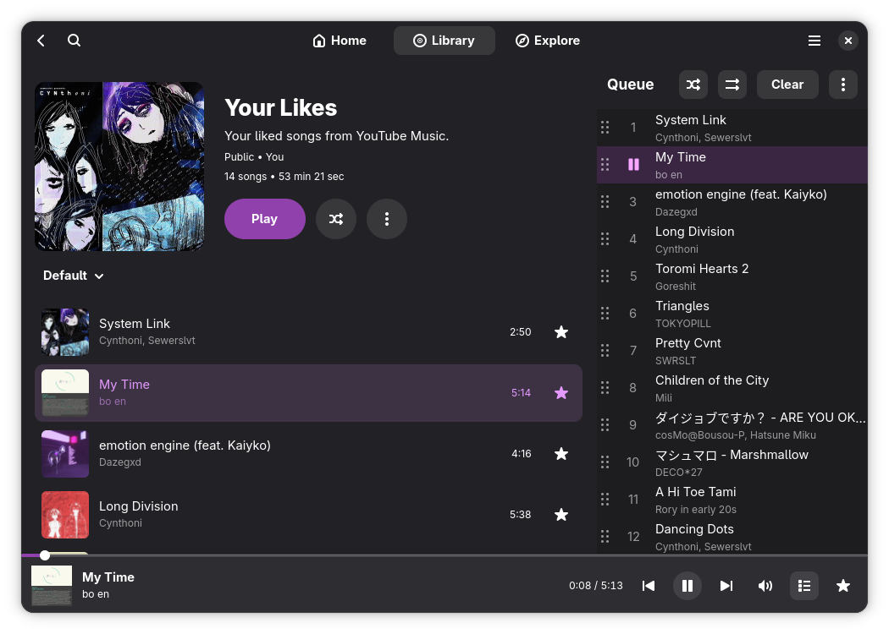
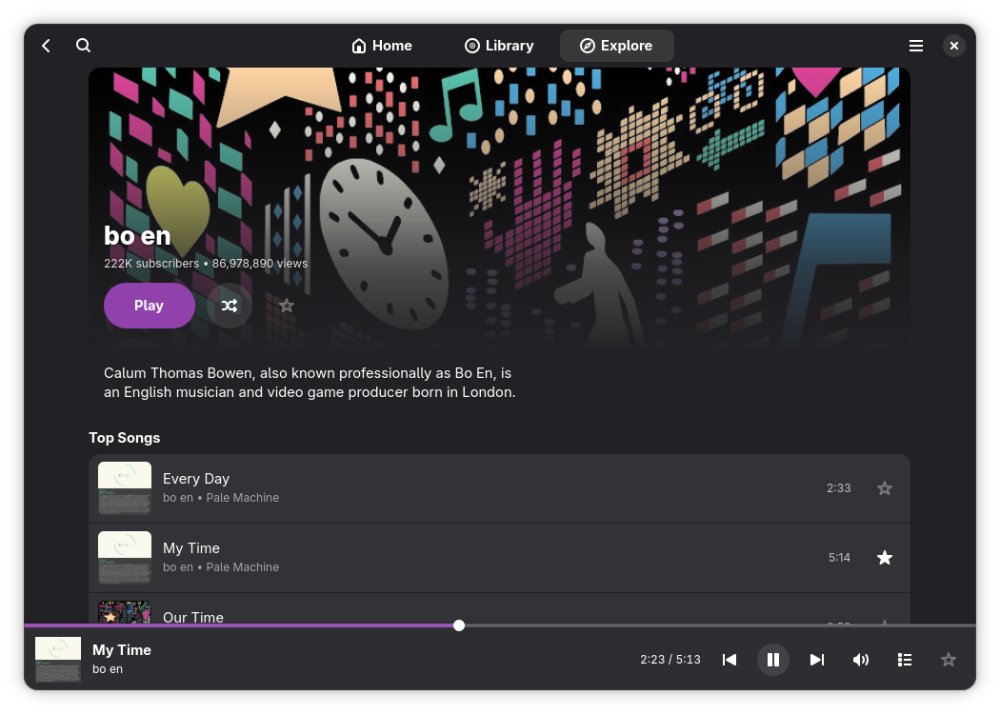
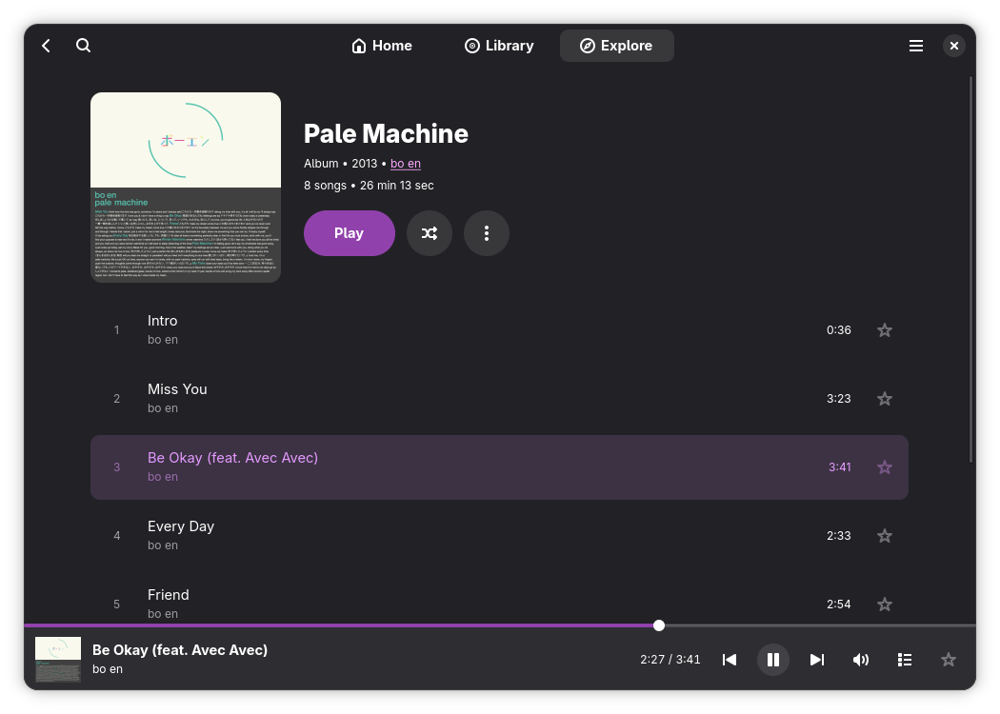

# Muse

A modern, Linux-first YouTube Music player.

> [!NOTE]
> This software is considered in alpha stage. Expect bugs and a lot of missing features.
> It is also not affiliated with, funded, authorized, endorsed, or in any way associated with YouTube, Google LLC or any of their affiliates and subsidiaries.
> Help is always appreciated, so feel free to open an issue or a pull request.





## Roadmap

This is a list of all the features that are planned for Muse:

[x] means the feature is implemented.
[-] means the feature is partially implemented.
[_] means the feature is not implemented yet, but planned.
[*] means the feature will likely not be implemented.

- [x] **Authentication**: Connect to YouTube Music (Browser cookies).
- [_] **Home Page**: View charts and explore new music.
- [-] **Library**: Access your playlists and liked songs.
  - [-] Playlists
    > Read only, cannot create or edit playlists yet.
  - [-] Liked songs
    > Read only, cannot like or unlike songs yet.
- [x] **Search**: Search for songs, albums, and artists.
- [-] **Artist Page**: View artist details and discography.
  - [x] Basic artist info.
  - [_] Artist related artists.
  - [x] Artist top tracks.
    > Currently only the first 5 tracks are shown, need to implement a "Show more" button as seen in the Web Player which would let you see the entire discography as well.
  - [-] Artist albums.
    > Only the first 10 albums are shown, need to implement a "Show more" button.
  - [-] Artist singles.
    > Only the first 10 singles are shown, need to implement a "Show more" button.
  - [-] Artist videos.
    > Only the first 10 videos are shown, need to implement a "Show more" button.
  - [_] Artist Play button
    > This button should start playing the artist's whole discography, not implemented yet.
  - [_] Artist Shuffle button
    > This button should start playing the artist's whole discography in a random order, not implemented yet.
  - [_] Artist Subscribe/Unsubscribe button
    > This button should subscribe/unsubscribe the artist, not implemented yet.
- [-] **Playlist Page**: View and play playlists.
  - [x] Basic playlist info.
  - [x] Playlist tracks.
  - [x] Playlist Play button
  - [x] Playlist Shuffle button
  - [_] Playlist Order
    > Currently the playlist has no order options, it shows up as is provided by the API. Need to implement a way to reorder a playlist.
  - [_] Playlist Cover Change
    > Currently the playlist cover cannot be changed.
  - [_] Playlist Change Visibility
    > Currently the playlist visibility cannot be changed.
  - [_] Playlist Change Description
    > Currently the playlist description cannot be changed.
  - [_] Playlist Change Name
    > Currently the playlist name cannot be changed.
- [x] **Album Page**: View and play albums.
  - [x] Basic album info.
  - [x] Album tracks.
  - [x] Album Play button
  - [x] Album Shuffle button
- [-] **Player**: Full playback control with queue management.
  - [x] Play/Pause
  - [x] Seeking
  - [-] Queue
    - [x] Previous/Next
    - [x] Change order of song
    - [x] Shuffle
    - [_] Repeat modes (single track, loop queue)
  - [_] Volume control
- [_] **Caching**: Cache data to reduce latency and bandwidth usage
- [-] **Responsive Design**: Mobile-friendly layout with adaptive UI.
  > Mostly there, but there remain some random edge cases with small width windows.
  > Help needed on this one!
- [_] **MPRIS Support**: Control playback from system media controls.
- [_] **Discord RPC**: Show your current track on Discord.
- [_] **Lyrics**: View synchronized lyrics, maybe even using BetterLyrics API.
- [_] **Settings**: Configure app preferences (theme, audio quality, etc.).
- [_] **Download Support**: Download tracks for offline playback, even as local files.
- [_] **Radio / Mixes**: Start a radio station from a song or artist.
- [_] **Dedicated Data Directory**: Move all the data like cookies, cache, etc. to a dedicated directory instead of the project root directory.
- [_] **Background Playback**: Play music in the background, even when the main window is closed.
- [_] **Flatpak**: Package Muse as a Flatpak.
- [_] **AppImage**: Package Muse as an AppImage.
- [_] **AUR**: Package Muse as an AUR package.

If you got any more ideas or bug reports, feel free to open an issue.

## Prerequisites

- Python 3.10 or higher
- GTK4 (including development headers)
- Libadwaita (including development headers)
- GStreamer plugins (base, good, bad, ugly)

## Installation

Currently, there is no packages for Muse, so you need to run it from source.

1. Clone the repository:

   ```bash
   git clone https://github.com/m-obeid/Muse.git
   cd Muse
   ```

2. Install Python dependencies within a virtual environment:
   ```bash
   python3 -m venv .venv
   source .venv/bin/activate
   pip install -r requirements.txt
   ```

## Usage

1. **Authentication (Optional but Recommended)**:
   This app uses `ytmusicapi` for backend data. Authentication allows access to your library and higher quality streams.

   To authenticate, you need to generate a `browser.json` file.
   - Run: `ytmusicapi browser`
   - Follow instructions to log in via your browser and paste the headers. It is recommended to use a private browser profile for this, so that you don't get logged out of the account from the app.
   - The output will be saved as `browser.json` in the project root directory.

   If you don't have a `browser.json` file, the app will use the unauthenticated API, which can cause playback issues.

   The OAuth flow is currently borked in `ytmusicapi`, don't use it. I removed it from the app, but there might be some leftover code.

2. **Run the Application**:
   From the project root directory:
   ```bash
   python3 src/main.py
   ```

## License

GNU General Public License as published by the Free Software Foundation, either version 3 of the License, or (at your option) any later version. See [LICENSE](LICENSE) for details.
